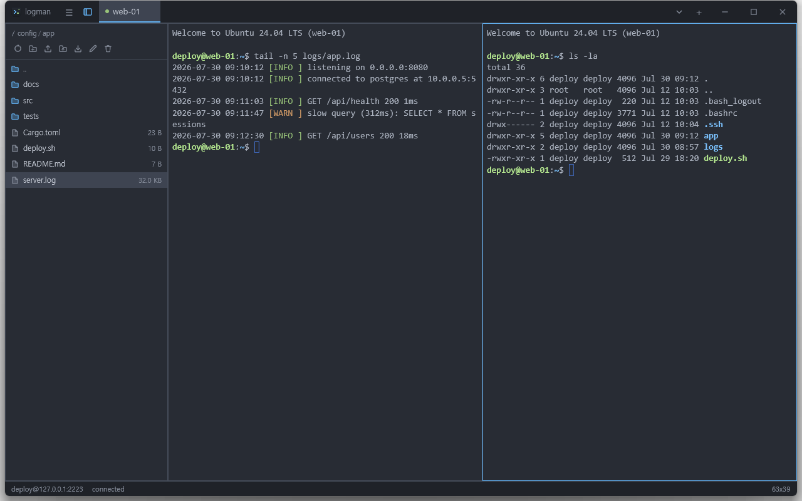

# logman user guide

logman is a GUI SSH terminal: one window, a strip of tabs, a real terminal in
each of them, and an SFTP file browser beside it. This guide covers everything
the application does. The [README](../README.md) is the short version.



## Contents

- [Getting started](#getting-started)
- [Tabs and sessions](#tabs-and-sessions)
- [Split panes](#split-panes)
- [The remote files panel](#the-remote-files-panel)
- [The terminal](#the-terminal)
- [Settings](#settings)
- [Keyboard shortcuts](#keyboard-shortcuts)
- [Data and security](#data-and-security)
- [Troubleshooting](#troubleshooting)

## Getting started

### Starting the application

Run the packaged binary, or build from a checkout:

```bash
cargo run --release -p logman-app
```

The window opens at 1100×700, centred, showing the start screen: the wordmark, a
hint naming the new-session shortcut, a **New session** button, and — once you
have connected to something at least once — a list of saved profiles. Clicking a
profile opens the connection dialog pre-filled from it.

### The connection dialog

<kbd>Ctrl</kbd>+<kbd>T</kbd> (<kbd>Cmd</kbd>+<kbd>T</kbd> on macOS), the **New
session** button, or the **+** at the right of the tab strip opens the dialog.
It has two columns: saved profiles on the left, the connection form on the
right.

The form:

| Field | What it does |
| --- | --- |
| **Name** | Label for the tab and the profile list. Left empty, it becomes the host name. |
| **Host** | Host name or address. Required. |
| **Port** | Digits only. Empty means 22. Anything outside 1–65535 is refused. |
| **Username** | The remote login name. Required. |
| **Authentication** | **Password**, **Private key** or **Agent**. |
| **Password** | Masked. Shown in password mode. |
| **Key file** | Path of the private key, with a **Browse…** button that opens the platform file picker. Shown in private key mode. |
| **Passphrase** | Masked, optional — an unencrypted key needs none. Shown in private key mode. |
| **Remember … in the system keychain** | Writes the password or passphrase to the OS keychain under the profile's identifier. |

**Agent authentication is offered but not implemented.** Choosing it disables
**Connect** and says so in the message strip, rather than failing later against
the server.

<kbd>Enter</kbd> in any field submits the form. If something is missing, the
message strip names the one thing to fix rather than listing everything.
<kbd>Tab</kbd> and <kbd>Shift</kbd>+<kbd>Tab</kbd> walk the controls;
<kbd>Esc</kbd>, the **Cancel** button and a click on the backdrop all dismiss
the dialog.

### Session overrides

**Session overrides** is a collapsible section at the bottom of the form. It
holds a color scheme, a font size, a scrollback depth and a `TERM` value that
apply to this profile alone. Every field is blank by default, and blank means
"inherit the global setting" — the placeholder says *inherit*, and the header
summarises how many settings the profile overrides. Opening a profile that has
overrides expands the section automatically.

### Reusing a profile

Connecting saves the profile, so the second connection to a host is one click.
Profiles appear in the dialog's left column and on the start screen:

- a single click loads a profile into the form;
- a double click loads it and connects immediately;
- **Edit** loads it without connecting, **Delete** forgets it — together with
  its keychain entry, so the credential store does not accumulate secrets
  nothing refers to any more.

A saved profile's password field opens empty. Leaving it empty reuses the secret
in the keychain; typing something new replaces it. The message strip says which
of the two is about to happen.

Connecting always works, even when the profile or the secret could not be
stored: the session opens and the dialog stays up with one sentence per problem,
so nothing is lost silently.

## Tabs and sessions

Each tab holds one session — or several, once you split it. The tab is labelled
with the remote shell's window title when it sets one (`OSC 0` / `OSC 2`), and
with the profile name otherwise, so a tab follows what you are doing rather than
what you opened.

A coloured dot on each tab reports the session's state:

| Dot | State | Meaning |
| --- | --- | --- |
| Accent | *connecting* | The transport is connecting, checking the host key, or authenticating. |
| Green | *connected* | The remote shell is live. |
| Muted | *disconnected* | The session ended. |
| Red | *failed* | The session could not be established. |

While a session is not connected, its pane shows a card over the terminal with
the same information: a headline, the detail line the SSH layer produced, and —
once the session has ended or failed — a **Reconnect** button. Reconnecting
reuses the profile and the credentials already in memory, resets the terminal so
the new shell starts on a clean screen, and picks up any `TERM`, keepalive or
timeout you have changed in the meantime.

The status bar along the bottom of the window reports the *active pane's*
session: its `user@host` label (with `:port` when the port is not 22), the
status summary, and the terminal grid as `columns`×`rows`.

Switching tabs: click one, press <kbd>Ctrl</kbd>+<kbd>1</kbd>…<kbd>9</kbd> for
the first nine, or use the **⌄** dropdown at the right of the strip when there
are more tabs than fit — it lists every tab and ticks the active one. The strip
scrolls the active tab into view on its own.

Every icon button along the top of the window names itself when the pointer
rests on it, shortcut included where the command has one.

Closing: the **×** on a tab closes the whole tab, panes and all.
<kbd>Ctrl</kbd>+<kbd>W</kbd> closes the *active pane*, which on an unsplit tab
is the same thing. Closing the last tab returns to the start screen rather than
quitting.

**A session whose connection ends takes its pane with it.** When the remote
shell exits or the server hangs up, the pane closes by itself, siblings grow
into the space, and the tab goes with its last pane. A session that *failed* to
connect is the exception: its pane stays so the error and the **Reconnect**
button remain readable.

## Split panes

A tab shows one session per pane. Splitting is how a tab comes to show several.

### Creating a split

There are two ways, and they differ in where the second session comes from.

**Open a second connection to the same host.**
<kbd>Alt</kbd>+<kbd>Shift</kbd>+<kbd>D</kbd> splits the focused pane to the
right, <kbd>Alt</kbd>+<kbd>Shift</kbd>+<kbd>S</kbd> splits it downwards
(<kbd>Cmd</kbd> instead of <kbd>Alt</kbd> on macOS). The same two commands sit
in the application menu — the **Session** menu on macOS — and in the menu a
right-click on the *active* tab opens.

The new pane connects afresh using the profile and the credentials the pane you
split is already holding, so nothing is asked for again. From then on the two
are unrelated: separate connections, separate shells, separate scrollback, and
closing one leaves the other alone. Nothing about the state of the original
matters either — a pane whose connection failed or has ended can still be
split, which is a way to try again while keeping the error on screen.

**Bring an existing tab in.** Right-click the tab you want to bring in and
choose **Split right of current tab** or **Split below current tab**. That tab
leaves the strip and its sessions appear next to the pane you are looking at, in
the direction you picked. If the source tab was itself split, the whole
arrangement moves over as a unit.

There is no keyboard shortcut for *that* one, because it has to name **which**
tab to pull in and a static command cannot.

A split that would leave an unusably small pane is not offered: the menu rows
disappear once the active pane is under 40 columns wide (for a side-by-side
split) or under 12 rows tall (for a stacked one), since each half inherits about
half the grid. The shortcuts are refused on the same threshold.

### Working in a split

Every pane is framed with a hairline once a tab holds more than one, and the
active pane's frame takes the accent colour. Clicking inside a pane focuses it,
which also moves the tab label, the status bar and the files panel onto that
pane's session. The files panel counts as somewhere focus can go: with it open a
lone terminal is framed too, and the accent moves to whichever of the two you
last clicked, so only ever one frame is lit.

<kbd>Alt</kbd>+<kbd>]</kbd> and <kbd>Alt</kbd>+<kbd>[</kbd>
(<kbd>Cmd</kbd> on macOS) cycle focus through the panes of the tab, wrapping
around at either end.

### Resizing a split

**Drag the divider between two panes to change their proportions.** The seam
carries an invisible grab strip six pixels wide, straddling the line; the
pointer turns into a horizontal resize cursor over a vertical divider and a
vertical one over a horizontal divider. The divider follows the pointer directly
— there is no ghost line trailing it — and keeps following even if the gesture
wanders outside the window.

Neither side can be squeezed below **10%** of the split. That is deliberate: a
pane dragged to nothing would take the divider handle with it and leave no way
to drag it back.

The terminals resize with their panes, and each one tells the remote pty about
its new grid the moment the column or row count actually changes.

Nested splits each have their own divider, and dragging one leaves the others
alone. A ratio survives switching tabs, closing a neighbouring pane, and being
merged into another tab — **but not a restart.** A split layout is session
state; every tab starts unsplit when the application starts.

### Undoing a split

<kbd>Alt</kbd>+<kbd>Shift</kbd>+<kbd>B</kbd> (<kbd>Cmd</kbd>+<kbd>Shift</kbd>+<kbd>B</kbd>
on macOS) moves the active pane back out into a tab of its own, placed right
after the current one. The same command is in the application menu, and in the
context menu of the active tab while that tab is split. The session keeps
running throughout — nothing reconnects.

## The remote files panel

The sidebar to the left of the terminal is an SFTP browser for the session in
the focused pane. It rides on the same SSH connection over a channel of its own,
so listing a directory or copying a file never holds up the shell — and the
shell never holds up a transfer.

<kbd>Ctrl</kbd>+<kbd>Shift</kbd>+<kbd>B</kbd> (<kbd>Cmd</kbd>+<kbd>B</kbd> on
macOS) shows and hides it, as does the panel button left of the tab strip and
the matching row in the application menu. It is shown by default.

The panel only lists files once the session is **connected**; while a session is
still connecting it says so rather than queueing a listing behind the
authentication.

### Browsing

- Double-click a directory to enter it, or the `..` row to go up. The `..` row
  is left out at the filesystem root.
- Directories sort before files, then by name, ignoring case.
- Folders take the accent colour, symlinks carry a small badge, and files show
  their size in the right-hand column.
- A name too long for the panel is cut off at the right. Resting the pointer on
  such a row shows the whole name; names that already fit stay quiet. Dragging
  the panel wider is the other way to read one.
- A single click selects a row; the selection is what the download button and
  the context menu act on, and it is dropped whenever the directory changes.
- **<kbd>Ctrl</kbd>-click** (<kbd>Cmd</kbd>-click on macOS) adds a row to the
  selection or takes it back out, leaving the rest alone.
- **<kbd>Shift</kbd>-click** selects everything between the last row clicked
  without <kbd>Shift</kbd> and this one, counted in the order the listing is
  *displayed* in — directories first, then by name — which is the only order
  visible on screen.
- The `..` row is never part of a selection.
- **The header is a breadcrumb**: the current path, broken into one pressable
  piece per directory. Pressing a piece opens a menu of the directories *beside*
  it — everything in its parent — and choosing one goes straight there. So the
  way from `/srv/app/releases/2026-07-30` into last week's release is one press
  on the last piece and one on the date you want, rather than a trip through
  `..`. The leading `/` has no parent, so it offers what is inside the root
  instead, which is the same menu the first name gives.
- A path too long for the header keeps its leaf and as many directories above it
  as fit; the rest fold into a single `…` piece. Pressing that piece lists
  exactly the directories that were folded away, so nothing in the path becomes
  unreachable. How much fits follows the panel's own width — dragging the edge
  wider unfolds the path as you go, and narrower folds more of it.
- **⟳** lists the directory again. It is also the way out of a failed first
  listing, which is not retried on its own — otherwise every chunk of terminal
  output would trigger another attempt.

**The toolbar under the path** is ordered by what each button needs. It opens
with the ones that act on the directory itself — **⟳** and the **folder-plus**
button that creates one — then the three transfer buttons, and it ends with the
**pencil** and the **bin**, which act on the selection. A button whose command
does not apply right now is dimmed and does nothing: the pencil wants exactly
one row selected, the bin and **↓** want at least one, and everything but **⟳**
waits for the first listing to land.

The destructive button is last on purpose. The row starts with the button
pressed most often and ends with the one that cannot be undone, so a click that
lands one button early hits a refresh rather than a delete.

Resting the pointer on any of them names it. Dimmed buttons are included, so a
button that will not take a click can still say what it would have done.

### Transferring files

- **↑** opens the platform file picker and uploads the chosen files into the
  directory on screen. Several files at once are fine; they go one after
  another.
- **The folder button beside it** uploads a whole folder. It is a *second*
  button rather than a second mode of the first because no platform picker
  offers files and folders in one dialog: macOS can, but Windows'
  `IFileOpenDialog` turns into a folder browser as soon as folders are allowed,
  and the Linux portal behaves the same way. Two buttons work identically
  everywhere.
- **↓** saves the selection locally, asking where to put it first. With one row
  selected that is a save dialog, opening in your home directory, and a selected
  **directory** is copied whole into a local folder of the name you choose. With
  several rows selected it is a *folder* picker instead: the entries keep the
  names they have on the server, and a local file of the same name is
  overwritten.
- **Dropping files or folders onto the panel uploads them** into the directory
  on screen. The panel's frame takes the accent colour while a drag is over it,
  the same way it does while the panel holds focus.
  The drop is the one place a mixture of files and folders can be handed over at
  once.
- The listing refreshes itself after an upload, so whatever landed before a
  failure is visible.

**Folders are copied recursively, with two rules about symbolic links:**

- A link **to a directory** is left out — of both directions. A tree can link
  back into itself, and a walk that followed such a link would either recurse
  until it ran out of memory or copy the same subtree forever. There is no cheap
  way to prove a given link is safe, so none of them are followed.
- A link **to a file** is transferred as its target, which is what dragging a
  link usually means.

Anything that cannot be read — a broken link, a file removed between the drop
and the walk — is left out and logged rather than failing the whole batch.

### The context menu

**Right-clicking a row** opens a menu acting on the selection. A right-click on
a row that is not selected selects it first; a right-click *inside* an existing
selection leaves that selection alone, which is how a command is aimed at
several entries at once.

- **Download…** — the same thing the **↓** button does.
- **Rename…** — offered only when exactly one row is selected.
- **Delete…** — asks before it does anything.
- **Refresh** — the same thing **⟳** does.

**Right-clicking empty space** — or the `..` row — opens the other menu, which
is about the directory rather than its contents: **New folder…**, **Upload
files…**, **Upload folder…** and **Refresh**. An empty directory still has a
background to right-click, so this is the way to upload into one.

Both menus close on <kbd>Esc</kbd> or on a click outside them.

### Creating a folder

Choosing **New folder…** — or pressing the **folder-plus** button in the toolbar,
which does the same thing — opens an empty, focused field along the bottom of
the panel. <kbd>Enter</kbd> or **Create** makes the directory in the one on
screen, **Cancel** drops the question. The same names are refused as for a
rename, and for the same reason.

A name already taken by a **directory** is not an error: the panel selects the
folder that is already there and says so. Nothing is overwritten and nothing
inside it is touched. A name taken by a **file** is a real collision, and the
server's refusal appears along the bottom.

### Renaming

Choosing **Rename…** — or pressing the **pencil** button, which needs exactly one
row selected — opens a field along the bottom of the panel, prefilled with the
current name and focused. <kbd>Enter</kbd> or **Rename** applies it,
**Cancel** drops it. A name that is empty, or that carries a `/`, a `\` or `..`,
is refused before anything is sent — such a name would move the entry into a
different directory rather than rename it in this one.

Whether an existing name is overwritten or refused is left to the server, which
is the only party that can answer it without a race. If it refuses, its own
message appears along the bottom.

The renamed row stays selected, so a second rename needs no second click.

### Deleting

Choosing **Delete…** — or pressing the **bin** button at the end of the toolbar —
asks first, along the bottom of the panel: the question names the entry when
there is one and counts them when there are more, and nothing is sent until
**Delete** is pressed. Cancelling — or switching to
another session, or leaving the directory — drops the question unasked.

- **A file is removed with one call.**
- **A symbolic link is removed as a link**, whatever it points at. A link to a
  directory looks like a directory in the listing, deliberately, so that it can
  be opened; deleting one removes the link and leaves the target untouched.
- **A directory is emptied from the leaves upwards.** SFTP has no recursive
  delete and refuses to remove a directory that still holds anything, so the
  panel walks the tree and removes the contents first.

The progress bar counts entries rather than bytes while this runs, and a delete
takes the same one-at-a-time slot a transfer does: neither can start while the
other is running. A failure stops the batch where it stands; the listing is
refreshed either way, so what did go is visible.

### Watching a transfer

The line along the bottom of the panel names the file in flight and the
percentage the **whole batch** has reached, with a thin progress bar under it.
The percentage keeps climbing across a folder rather than restarting at every
file, because the total is worked out from the tree before the first byte moves.

**One transfer runs per session at a time.** A second upload or download asked
for while one is running is refused with a note on that same line, not queued:
one bar cannot honestly describe two transfers. Other sessions are unaffected —
each tab has its own panel state and its own transfer slot.

A transfer cannot be cancelled once it has started. A failure stops the batch
where it is, leaves what already landed in place, and stays on the status line
until something else works.

### Resizing the panel

**Drag the panel's right edge to change its width.** The edge carries a grab
strip six pixels wide and the pointer turns into a horizontal resize cursor over
it. The width is clamped to **180–560 pixels**: narrower and the header path
collides with the toolbar buttons, wider and the panel stops being a sidebar.

Like the split ratios, the width is session state — the panel opens at **260
pixels** every time the application starts. So is whether the panel is showing
at all.

### Following the shell

**The panel follows the remote shell's `cd`, but only if the shell says so.**
Directory tracking is driven by the `OSC 7` escape sequence — logman also
accepts iTerm2's `OSC 1337 ; CurrentDir=` variant — which fish emits out of the
box. bash and zsh need one line.

In `~/.bashrc`:

```bash
PROMPT_COMMAND='printf "\033]7;file://%s%s\033\\" "$HOSTNAME" "$PWD"'
```

or in `~/.zshrc`:

```zsh
precmd() { printf '\033]7;file://%s%s\033\\' "$HOST" "$PWD" }
```

Without it the panel starts in the login directory and stays wherever you
navigate it by hand.

The two sources are allowed to disagree. Browsing by hand always wins until the
shell announces a new directory, at which point the panel follows again. There
is no "locked" mode, because the next `cd` re-synchronises the two anyway.

### One panel, many sessions

There is one panel for the window, not one per session — but each session keeps
its own directory, entries, selection and scroll position. Switching tabs or
panes restores what that session was showing instead of asking the server again.
The state is dropped when the session's pane closes.

## The terminal

logman is a real terminal, not a log view: `alacritty_terminal` drives the
emulation, so colours, cursor addressing, the alternate screen and full-screen
programs — vim, tmux, htop, less — behave the way they do in any other terminal.
The terminal answers Device Status Report and Device Attributes queries, which
is what keeps those programs from hanging on start-up.

### Selecting, copying and pasting

Drag across the grid to select. The selection spans whole rows between its two
ends, in the usual way, and is anchored to the viewport.

<kbd>Ctrl</kbd>+<kbd>Shift</kbd>+<kbd>C</kbd> copies it and
<kbd>Ctrl</kbd>+<kbd>Shift</kbd>+<kbd>V</kbd> pastes — plain
<kbd>Cmd</kbd>+<kbd>C</kbd> and <kbd>Cmd</kbd>+<kbd>V</kbd> on macOS. The
shifted chords are used elsewhere because <kbd>Ctrl</kbd>+<kbd>C</kbd> and
<kbd>Ctrl</kbd>+<kbd>V</kbd> have to stay available to the remote shell.

Turning on **copy on select** in the settings mirrors the selection to the
clipboard as soon as the mouse is released. It does not consume the selection —
the text stays highlighted.

A paste is encoded according to the terminal's current modes, so bracketed paste
works where the remote program asked for it.

### Scrolling

The mouse wheel scrolls back through the scrollback; fractional wheel deltas are
accumulated so a trackpad scrolls smoothly. Typing snaps the viewport back to
the bottom, the way every other terminal does. The depth of the scrollback is a
setting, global or per profile.

Every surface that scrolls — the terminal, the files panel, the tab strip and
the settings dialog — shows a slim indicator over its edge while it is being
scrolled, which you can drag to move around, and which fades two seconds after
you stop.

### Input

Printable characters go through the platform's text input path, so dead keys,
compose sequences and IMEs all work. Everything else — control keys, function
keys, arrow keys, modifier chords — is encoded and sent directly, honouring the
terminal's cursor-key and keypad modes.

While an IME composition is in flight the preedit is drawn at the cursor and
**nothing reaches the remote host until it is committed**. Composition has only
been exercised with the Microsoft Korean IME on Windows; see the README's
[Limitations](../README.md#limitations) for what that implies.

The shortcuts logman binds are taken away from the remote shell — gpui matches
key bindings before delivering the key event. That is why the pane and panel
shortcuts avoid a bare <kbd>Ctrl</kbd> off macOS: <kbd>Ctrl</kbd>+<kbd>[</kbd>
is ESC to a remote shell, and <kbd>Ctrl</kbd>+<kbd>B</kbd> is tmux's prefix key.

## Settings

<kbd>Ctrl</kbd>+<kbd>,</kbd> (<kbd>Cmd</kbd>+<kbd>,</kbd> on macOS), or
**Settings…** in the application menu, opens the settings dialog. It has three
sections.

### Appearance

| Setting | Values | Notes |
| --- | --- | --- |
| **UI theme** | One Dark, One Light, Solarized Dark, Solarized Light, Gruvbox Dark, Dracula, plus any of your own | One Dark by default. Each card previews the palette it stands for. Also recolours the window caption on Windows. See [Themes and colour schemes](#themes-and-colour-schemes). |
| **Title bar** | Custom, System | Custom by default: the tab strip doubles as the title bar, with the application name at one end and the window buttons at the other. System brings back the caption the operating system draws. |
| **Language** | System default, or one of eight | German, English, Spanish, French, Japanese, Korean, Russian, Simplified Chinese. Each is listed under its own name. |
| **Opacity** | 50–100% | Below 100 the window becomes translucent. |
| **Blur the desktop behind the window** | on/off | Where the platform supports it. Blur wins over plain translucency. |

### Terminal

| Setting | Values | Notes |
| --- | --- | --- |
| **Color scheme** | One Dark, One Light, Solarized Dark, Solarized Light, Gruvbox Dark, Dracula, plus any of your own | Each card shows a live preview of its background, foreground and six ANSI colours. One Dark by default. See [Themes and colour schemes](#themes-and-colour-schemes). |
| **Font** | System default, or any installed family | The list is read from the fonts on the machine each time the dialog opens. |
| **Font size** | 6–32 pt | 14 by default. |
| **Scrollback** | up to 100 000 lines | 5 000 by default. |
| **TERM** | any string | `xterm-256color` by default. |
| **Copy the selection on mouse release** | on/off | Off by default. |

The system font default is the first of a per-OS candidate list that is actually
installed: Consolas, Cascadia Mono, Courier New on Windows; Menlo, Monaco,
Courier New on macOS; DejaVu Sans Mono, Liberation Mono, Noto Sans Mono
elsewhere.

### New connections

| Setting | Values | Notes |
| --- | --- | --- |
| **Port** | 1–65535 | Pre-filled into the connection form. 22 by default. |
| **Username** | any string | Pre-filled into the connection form. None by default. |
| **Keepalive** | seconds, 0 disables | 30 by default. |
| **Connect timeout** | seconds | How long to wait for the TCP connection. 15 by default. |

### Themes and colour schemes

The two palettes are chosen independently. The **UI theme** colours the chrome
— window, tab strip, dialogs, the file panel — and the **colour scheme** colours
the terminal grid. Six of each ship with logman under the same six names, so
picking "Dracula" in both places is one word twice.

Beyond the six, both are files, and both live next to `settings.json`:

| | Directory | Format |
| --- | --- | --- |
| UI themes | `themes/` | logman's own: a `name`, a `dark` flag and eleven colour slots under `colors`. |
| Colour schemes | `schemes/` | Windows Terminal's, unchanged — so every palette published for it is a logman scheme, `purple` for magenta included. |

One `*.json` file per palette. The **file name is the id**, so
`schemes/tokyo-night.json` is the scheme `tokyo-night`, and that is what
`settings.json` — or a profile override — stores. The `name` key inside is what
the picker shows, and the two need not match. Both formats are read as
forgivingly as `settings.json` is: unknown keys are ignored, a colour that
cannot be parsed keeps the built-in colour for that slot, a leading byte order
mark is tolerated, and one broken file never keeps the others, or the
application, from loading. A file whose name collides with a built-in id is
skipped, since it could never be selected anyway.

#### Managing them from the dialog

Under each of the two pickers sits a row of five buttons, which act on whatever
card is currently selected.

| Button | What it does |
| --- | --- |
| **Duplicate** | Copies the selected palette — a built-in one included — into a file of its own named "… copy", then opens it for editing. This is how a palette of your own usually starts. |
| **Edit** | Opens a palette you own. Greyed out for the six that ship with logman; duplicate one instead. |
| **Delete** | Removes the file, after asking. The picker falls back to the default palette. |
| **Import** | Reads `*.json` files from anywhere on the disk into the right directory. Several at once; anything that is not a palette of that kind is skipped, and the dialog says so if nothing could be read at all. |
| **Export** | Writes the selected palette out to a file you choose — built-in ones included, which is the easiest way to get a starting point to edit elsewhere or to share. |

An imported palette whose name collides with one already there gets a `-2`,
`-3`, … suffix rather than overwriting it, and one whose name is written in a
script that yields no id — `테마` — is filed under a generated `theme-1` /
`scheme-1` instead.

#### The editor

The editor replaces the settings form while it is open. It shows the palette's
name, a **dark palette** checkbox for a UI theme, one row per colour — a label,
a `#RRGGBB` field and a swatch — and a live preview at the top that follows
your typing. A scheme's sixteen ANSI colours come under their own heading,
each paired with its bright variant.

- A field that does not hold a colour is outlined in red, its swatch goes
  empty, and **Save** is held back until it is fixed. Only a UI theme's
  `overlay` slot takes the extra `#RRGGBBAA` alpha pair; every other slot is
  six digits.
- **Save** writes the file and applies it at once — see below.
- **Cancel**, <kbd>Esc</kbd>, or a click outside the panel discards the edits
  and returns to the settings form without closing it.
- The id is fixed when the editor opens and never follows the name, so renaming
  a palette cannot orphan the setting, or the profile override, that selected
  it.

### When a change takes effect

- **UI theme, language, opacity, blur** — immediately, across the whole window.
- **A palette saved in the editor** — immediately, without saving the settings:
  a theme already in use repaints the window, and a scheme already in use
  repaints every open session, background tabs included. Selecting a
  *different* palette in a picker, on the other hand, is an ordinary setting
  and takes effect when the dialog is saved.
- **Title bar** — immediately on Windows and macOS: the open window swaps its
  caption in place. On Linux the window keeps the compositor's title bar either
  way.
- **Color scheme and font** — immediately, in every open session, background
  tabs included.
- **`TERM`, keepalive, connect timeout** — on the next connect or reconnect. The
  `TERM` value has already been negotiated with the remote pty, so it cannot
  change under a live shell.
- **Scrollback depth** — for sessions opened after the change. Resizing the
  scrollback of a live terminal would rebuild its grid and clear the screen.

A profile's **session overrides** layer on top of all of this. The same rules
apply to them, and an empty override field inherits the global value.

### settings.json

Everything lands in `settings.json` in the configuration directory, next to the
profiles, and it is meant to be edited by hand:

- unknown keys are ignored, so a file written by a newer logman still opens;
- missing keys fall back to the documented defaults;
- out-of-range numbers are **clamped rather than rejected** — an opacity of 0
  loads as 0.5, a font size of 400 as 32, a scrollback of ten million as
  100 000, and a blank string as its default;
- a leading UTF-8 byte order mark is tolerated, which Windows editors readily
  add;
- writes are atomic: the data lands in a temporary sibling file that is then
  renamed over the target, so a crash mid-write cannot leave a half-written
  configuration behind.

logman reads the file at start-up and when the settings dialog opens. It does
not watch it, so an edit made while the application is running is picked up the
next time one of those happens.

## Keyboard shortcuts

The table is written for Windows and Linux. On macOS every <kbd>Ctrl</kbd> and
<kbd>Alt</kbd> below is <kbd>Cmd</kbd>, copy and paste are plain
<kbd>Cmd</kbd>+<kbd>C</kbd> / <kbd>Cmd</kbd>+<kbd>V</kbd>, and the files panel
is plain <kbd>Cmd</kbd>+<kbd>B</kbd>.

| Key | macOS | Action |
| --- | --- | --- |
| <kbd>Ctrl</kbd>+<kbd>T</kbd> | <kbd>Cmd</kbd>+<kbd>T</kbd> | New session |
| <kbd>Ctrl</kbd>+<kbd>W</kbd> | <kbd>Cmd</kbd>+<kbd>W</kbd> | Close the active pane, and the tab with its last one |
| <kbd>Ctrl</kbd>+<kbd>1</kbd>…<kbd>9</kbd> | <kbd>Cmd</kbd>+<kbd>1</kbd>…<kbd>9</kbd> | Switch to tab *n* |
| <kbd>Alt</kbd>+<kbd>]</kbd> | <kbd>Cmd</kbd>+<kbd>]</kbd> | Focus the next pane of the tab |
| <kbd>Alt</kbd>+<kbd>[</kbd> | <kbd>Cmd</kbd>+<kbd>[</kbd> | Focus the previous pane of the tab |
| <kbd>Alt</kbd>+<kbd>Shift</kbd>+<kbd>D</kbd> | <kbd>Cmd</kbd>+<kbd>Shift</kbd>+<kbd>D</kbd> | Split the active pane to the right, with a new connection to the same host |
| <kbd>Alt</kbd>+<kbd>Shift</kbd>+<kbd>S</kbd> | <kbd>Cmd</kbd>+<kbd>Shift</kbd>+<kbd>S</kbd> | Split the active pane downwards, with a new connection to the same host |
| <kbd>Alt</kbd>+<kbd>Shift</kbd>+<kbd>B</kbd> | <kbd>Cmd</kbd>+<kbd>Shift</kbd>+<kbd>B</kbd> | Move the active pane into its own tab |
| <kbd>Ctrl</kbd>+<kbd>Shift</kbd>+<kbd>B</kbd> | <kbd>Cmd</kbd>+<kbd>B</kbd> | Show or hide the remote files panel |
| <kbd>Ctrl</kbd>+<kbd>Shift</kbd>+<kbd>C</kbd> | <kbd>Cmd</kbd>+<kbd>C</kbd> | Copy the selection |
| <kbd>Ctrl</kbd>+<kbd>Shift</kbd>+<kbd>V</kbd> | <kbd>Cmd</kbd>+<kbd>V</kbd> | Paste |
| <kbd>Ctrl</kbd>+<kbd>,</kbd> | <kbd>Cmd</kbd>+<kbd>,</kbd> | Open the settings dialog |
| <kbd>Esc</kbd> | <kbd>Esc</kbd> | Dismiss the topmost dialog or menu |
| <kbd>Ctrl</kbd>+<kbd>Q</kbd> | <kbd>Cmd</kbd>+<kbd>Q</kbd> | Quit |

Inside a dialog, <kbd>Tab</kbd> and <kbd>Shift</kbd>+<kbd>Tab</kbd> move between
controls and <kbd>Enter</kbd> submits from any field. Both are scoped to the
dialog, so the terminal keeps sending <kbd>Tab</kbd> to the remote shell for
completion.

<kbd>Esc</kbd> works through the overlays in order — a tab context menu, then a
dropdown menu, then the about box, the connection dialog and the settings
dialog. With none of them open the key falls through to the terminal, which
sends it to the remote shell.

<kbd>Ctrl</kbd>+<kbd>T</kbd>, <kbd>Ctrl</kbd>+<kbd>W</kbd>,
<kbd>Ctrl</kbd>+<kbd>Q</kbd>, <kbd>Ctrl</kbd>+<kbd>,</kbd> and the pane
shortcuts belong to the application, so the remote shell never sees them.

### Menus

On macOS the commands live in the system menu bar, under **logman** (About,
Settings, Quit) and **Session** (New Session, Close Session, Move Pane to Its
Own Tab, Remote Files). Elsewhere the same commands are behind the menu button
at the left of the toolbar.

Right-clicking a tab opens its context menu. What it offers depends on which tab
you clicked: the two split commands on any other tab, **Move pane to its own
tab** on the active tab while it is split, and **Close tab** always. A command
that would be refused is left out rather than shown doing nothing.

## Data and security

### Where things are stored

| Platform | Directory |
| --- | --- |
| Windows | `%APPDATA%\logman\logman\config\` |
| macOS | `~/Library/Application Support/dev.logman.logman/` |
| Linux | `~/.config/logman/` |

| File | Contents |
| --- | --- |
| `profiles.json` | Saved connections: name, host, port, user, authentication method, key path, and any session overrides. |
| `known_hosts` | Trusted host key fingerprints. |
| `settings.json` | Everything in the settings dialog. |
| `themes/*.json` | UI themes of your own, one file per theme. Created on demand; see [Themes and colour schemes](#themes-and-colour-schemes). |
| `schemes/*.json` | Terminal colour schemes of your own, in Windows Terminal's format. |

All of them are plain text, safe to edit by hand, written atomically, and
tolerant of a UTF-8 byte order mark. The two directories only exist once there
is something in them.

### Secrets

**Passwords and key passphrases are never written to any of those files.** They
go to the Windows Credential Manager, the macOS Keychain, or the freedesktop
Secret Service, under the service name `dev.logman.logman` with the profile's
identifier as the account — and only when "Remember … in the system keychain" is
ticked.

Without a usable keychain — a headless Linux box, a locked Secret Service — the
application still runs. It logs a warning at start-up, reads behave as if
nothing had ever been saved, and you are asked for the secret every time. An
attempt to *save* a secret in that state is reported in the dialog's message
strip.

Deleting a profile deletes its keychain entry too.

### Host key policy

logman follows the trust-on-first-use convention OpenSSH popularised.

- **A key never seen before** is recorded, saved, and accepted. If `known_hosts`
  cannot be written, the host is trusted for this run only and a warning is
  logged.
- **A key that matches the record** is accepted silently.
- **A changed fingerprint aborts the connection** rather than prompting. Both
  the stored and the presented fingerprint are logged at error level, and the
  session fails with *host key rejected*. A changed host key can mean a
  machine-in-the-middle attack.

Keys are recorded per host, port *and* algorithm, matching OpenSSH: a server may
legitimately offer both an Ed25519 and an RSA host key.

`known_hosts` is one record per line:

```text
# logman known hosts: <host> <port> <algorithm> <fingerprint>
example.com 22 ssh-ed25519 SHA256:47DEQpj8HBSa+/TImW+5JCeuQeRkm5NMpJWZG3hSuFU
```

Blank lines and `#` comments are ignored, host names are compared
case-insensitively, and a malformed line is logged and skipped rather than
failing the whole file. **If a server was legitimately rebuilt, delete its line
and connect again** to trust the new key.

## Troubleshooting

### The session fails to connect

The status bar and the overlay card name the failure kind, followed by the
detail from the SSH layer:

| Kind | What it means | What to check |
| --- | --- | --- |
| *connection failed* | Name resolution, the TCP connect, the connect timeout, or the protocol handshake. Authentication was never reached. | The host name and port, the network, whether the server is listening. Raise **Connect timeout** in the settings for a slow link. |
| *host key rejected* | The presented fingerprint differs from the stored one. | Confirm the server was rebuilt on purpose, then remove its line from `known_hosts`. Do not do this because it is convenient. |
| *authentication failed* | The server refused the credentials. | The user name, the password or key, and whether the server accepts that method. MFA-protected servers cannot be reached — keyboard-interactive authentication is not implemented. |
| *private key could not be loaded* | The key file could not be read, parsed, or decrypted. | The path, the file's format, and the passphrase. |
| *channel request failed* | The pty or the shell request was refused. | The account's shell, and whether the server permits pty allocation. |
| *i/o error* | The transport dropped. | The network, and the server's logs. |

**A session stuck in *connecting*** means the server accepted the TCP connection
and then never answered the pty or shell request. There is no timeout on those,
so close the tab to cancel it.

### The files panel does not follow `cd`

The panel only moves when the shell announces the new directory. Check, in
order:

1. The session is **connected** — the panel does not list anything before that.
2. The shell emits `OSC 7`. Run
   `printf '\033]7;file://%s%s\033\\' "$HOSTNAME" "$PWD"` by hand in the remote
   shell: if the panel jumps, the sequence works and the prompt hook is missing.
   Add the `PROMPT_COMMAND` or `precmd` line from
   [Following the shell](#following-the-shell).
3. The hook is in a file the shell actually reads. A non-interactive or
   non-login shell may skip `~/.bashrc`.
4. Nothing on the remote side is stripping escape sequences — `screen` and some
   multiplexer configurations do.

If the panel is simply showing something stale, **⟳** lists the directory again.

### Fonts and text

A missing glyph means the terminal font does not cover the character. Pick a
family with wider coverage in **Settings → Terminal → Font**; the list shows
what is installed on the machine. Setting the font back to **System default**
falls back to the first per-OS candidate that is installed.

If the interface is in the wrong language, set it explicitly in **Settings →
Appearance → Language** instead of leaving it on **System default**. An
untranslated string falls back to English on its own, per string, so a partially
translated locale still works.

For IME issues, see the README's
[Limitations](../README.md#limitations): composition is verified only against
the Microsoft Korean IME on Windows, and the vendored gpui patch is required
there.

### Colours look wrong

A program that redefines the palette at runtime with `OSC 4` or `OSC 10`–`11` is
ignored; the session renders with the static scheme. Nothing needs to be done
about it, and nothing can be.

### Getting more detail

logman logs through `env_logger`. Set `RUST_LOG` before starting it to see what
the SSH layer is doing:

```bash
RUST_LOG=logman_ssh=debug,logman_app=debug cargo run --release -p logman-app
```

Host key decisions, remote directory changes, resize requests and connection
failures are all logged there. Keystrokes never are — only their byte count.

### Known limitations

The full list is in the README's [Limitations](../README.md#limitations)
section. The ones that come up most:

- no SSH agent support, and no keyboard-interactive authentication;
- the files panel cannot change permissions or ownership, and cannot cancel a
  transfer or a delete once it has started;
- panes can be resized by dragging but not rearranged, and neither a split
  layout nor the panel's width survives a restart;
- a selection is anchored to the viewport and is not re-anchored when the
  scrollback moves under it.
